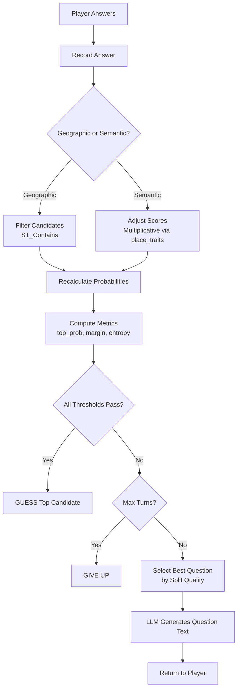

# Algorithm Specification

This document defines the mathematical formulas and decision logic for the geographic guessing game. All tunable values are stored in config tables and referenced by key name. Most algorithm parameters live in `game_logic.config` (server-only), while `public.config` holds client-visible settings like `game.max_turns`.

## Overview

The game uses four core algorithms:

1. **Candidate Scoring** - Rank places by similarity to description
2. **Confidence Decision** - Determine when to guess vs ask
3. **Trait Matching** - Update scores based on question answers
4. **Question Selection** - Choose maximally discriminating questions

All logic runs in PostgreSQL. Frontend receives only the decision outcome.

## Turn Flow



---

## 1. Candidate Scoring

### Initial Scoring

Places are scored using **softmax-weighted aggregation of trait similarities**. This approach compares the player's description against each place's individual traits rather than a combined embedding, which handles both categorical descriptions ("religious site") and specific descriptions ("tall iron tower in Paris") effectively.

For each place, compute similarity between the description and each of its traits:

```
trait_similarities = [similarity(description.embedding, trait.embedding) for trait in place.traits]
```

Then aggregate using softmax-weighted average:

```
weights_i = exp(sim_i / τ) / Σ_j exp(sim_j / τ)
raw_score(place) = Σ_i (weights_i × sim_i)
```

Where τ (temperature) is `config.scoring.trait_aggregation_temperature`:

- τ → 0: Approaches MAX (only best trait matters)
- τ = 0.1: Top 2-3 traits dominate (recommended)
- τ → ∞: Approaches simple average

**Why softmax-weighted?**

- Every trait embedding contributes meaningfully
- High-similarity traits get high weights, low-similarity traits contribute less
- Output is bounded between min and max similarity (interpretable)
- Smooth gradients - small changes in similarity produce smooth score changes

**Example:** "religious site" matching Sagrada Família (τ=0.1):

| Trait                    | Similarity | Weight   | Contribution |
| ------------------------ | ---------- | -------- | ------------ |
| Christian religious site | 0.92       | 0.73     | 0.67         |
| Catholic religious site  | 0.87       | 0.19     | 0.17         |
| Historic monument        | 0.45       | 0.04     | 0.02         |
| Spain                    | 0.30       | 0.02     | 0.01         |
| **Total**                |            | **1.00** | **0.87**     |

### Initial Candidate Selection

Candidates are selected using threshold with cap:

```
1. Get all places with raw_score >= config.scoring.initial_candidate_threshold
2. Order by raw_score descending
3. Limit to config.scoring.max_initial_candidates
```

This ensures:

- Only semantically relevant places are considered (threshold)
- Performance stays bounded regardless of database size (cap)
- Categorical queries ("religious site") find relevant places via trait matching

### Probability Distribution

Raw scores are converted to probabilities using temperature-scaled softmax:

```
P(place_i) = exp(raw_score_i / config.scoring.temperature) / Σ exp(raw_score_j / config.scoring.temperature)
```

Lower temperature values create sharper distributions (amplify score differences). Higher values create flatter distributions (more uncertainty).

After each answer, probabilities are recalculated to reflect updated scores.

---

## 2. Confidence Decision

### Decision Metrics

Three metrics determine whether to guess or ask another question:

**Top Probability** - Confidence in best candidate

```
top_prob = max(P(place_i))
```

**Separation Margin** - Gap between top two candidates

```
margin = P(top_candidate) - P(second_candidate)
```

**Normalized Entropy** - Distribution concentration

```
entropy = -Σ P(i) × ln(P(i))
normalized_entropy = entropy / ln(candidate_count)
```

Ranges from 0 (all confidence in one candidate) to 1 (uniform distribution).

### Decision Rule

```
IF top_prob >= config.confidence.top_prob_threshold
   AND margin >= config.confidence.margin_threshold
   AND normalized_entropy <= config.confidence.entropy_threshold
THEN → GUESS top candidate
ELSE → ASK another question
```

Each metric catches different failure modes:

- `top_prob` catches "no clear winner"
- `margin` catches "top two too close"
- `entropy` catches "confidence spread across many candidates"

### Edge Cases

| Scenario                     | Behavior                  |
| ---------------------------- | ------------------------- |
| Single candidate remaining   | Automatic GUESS           |
| All scores identical         | All thresholds fail → ASK |
| Two candidates, nearly equal | Margin fails → ASK        |

---

## 3. Trait Matching

When the player answers a question about a trait, candidate scores are adjusted based on whether each place has that trait. This uses the **ground truth relationship** in `place_traits` table rather than embedding similarity.

### Trait Ownership

For each candidate place and the asked trait:

```
has_trait(place, trait) = EXISTS(
  SELECT 1 FROM place_traits
  WHERE place_id = place.id AND trait_id = trait.id
)
```

This is a **binary determination** - the place either has the trait or it doesn't. No fuzzy matching needed because we have explicit relationships.

### Score Adjustment

Adjustments use multiplicative scaling for numerical stability:

```
boost_factor = config.traits.boost_factor      # e.g., 1.5
penalty_factor = config.traits.penalty_factor  # e.g., 0.6
```

The multiplier depends on the answer and trait ownership:

| Answer   | Has Trait? | Multiplier     | Rationale                              |
| -------- | ---------- | -------------- | -------------------------------------- |
| YES      | TRUE       | boost_factor   | Candidate has affirmed trait           |
| YES      | FALSE      | penalty_factor | Candidate lacks affirmed trait         |
| NO       | TRUE       | penalty_factor | Candidate has denied trait             |
| NO       | FALSE      | boost_factor   | Candidate correctly lacks denied trait |
| NOT SURE | Any        | 1.0            | No adjustment                          |

### Applying Adjustments

```
new_score(place) = old_score(place) × multiplier
```

After adjustments, recalculate probability distribution via softmax.

### Why Binary Instead of Similarity?

The previous approach used `similarity(place.embedding, trait.embedding)`, but this was redundant:

- We have explicit `place_traits` relationships (ground truth)
- Embedding similarity adds noise when we already know the answer
- Binary matching is faster and more accurate

Embeddings are still used for:

1. **Initial candidate scoring** - matching description to traits
2. **Question selection tiebreaker** - finding traits relevant to description

---

## 4. Question Selection

### Goal

Select the question that maximally discriminates between current candidates. The ideal question splits candidates 50/50 (half would answer yes, half no).

### Split Quality

For each potential trait question, use the `place_traits` relationship to count how many candidates have that trait:

```sql
SELECT
  trait_id,
  COUNT(*) FILTER (
    WHERE
      place_id IN (candidate_ids)
  ) as yes_count,
  total_candidates - yes_count as no_count
FROM
  place_traits
GROUP BY
  trait_id
```

Split quality measures how close to 50/50:

```
fraction_matching = yes_count / candidate_count
split_quality = 1 - |0.5 - fraction_matching|
```

| Fraction Matching | Split Quality |
| ----------------- | ------------- |
| 0.50              | 1.0 (perfect) |
| 0.30 or 0.70      | 0.8 (good)    |
| 0.10 or 0.90      | 0.6 (poor)    |
| 0.00 or 1.00      | 0.5 (useless) |

**Note:** Split quality uses `place_traits` (ground truth), not embedding similarity. This is fast and accurate.

### Selection Algorithm

```
1. Get all traits not yet asked in this session
2. For each trait, calculate split_quality against current candidates using place_traits
3. Filter traits where split_quality >= config.questions.min_split_quality
4. Select trait with highest split_quality
5. TIEBREAKER: If multiple traits have equal split_quality,
   prefer the trait most similar to the player's description
   (using trait embeddings vs description embedding)
```

Selection is deterministic and algorithmic; the LLM is used only to phrase the chosen trait/region as a natural-language question, not to choose which question to ask.

### Poor Split Quality

If no trait meets `min_split_quality` threshold:

- Select the trait with the highest split_quality anyway (best available)
- The question may not be very discriminating, but it's what we have
- Over time, as more games are played and learning happens, the trait database improves
- No special fallback logic - system always picks the best available option

### Geographic vs Semantic Questions

The game can ask about geographic regions (PostGIS) or semantic traits (pgvector).

```
1. Calculate best geographic question split_quality
2. Calculate best semantic question split_quality
3. IF geographic_split >= config.questions.geographic_preference_threshold
   → Ask geographic question (binary filter is simpler)
4. ELSE
   → Ask semantic question with best split_quality
```

Geographic questions use PostGIS `ST_Contains` for binary in/out filtering. Semantic questions use the trait matching system described above (binary from `place_traits`).

---

## 5. Spatial Filtering

### Integration Pattern

Each turn asks ONE question type (geographic OR semantic). This enables sequential filtering rather than complex hybrid scoring.

**Geographic Answer (YES):**

```
candidates = candidates.filter(ST_Contains(affirmed_region, place.geom))
```

**Geographic Answer (NO):**

```
candidates = candidates.filter(NOT ST_Contains(denied_region, place.geom))
```

**Semantic Answer:**
Apply trait matching adjustments (Section 3), then recalculate probabilities.

### Why Not Hybrid Scoring?

A weighted formula like `score = w1 × semantic + w2 × spatial` would require tuning weights. Since each turn is single-mode, one weight would always be zero. Sequential filtering achieves the same result with simpler logic.

---

## 6. Trait Sources

Traits are extracted from real Nominatim data by LLM, not invented or hardcoded.

### Extraction Sources

| Nominatim Field      | Trait Examples             |
| -------------------- | -------------------------- |
| `class`              | tourism, historic, natural |
| `type`               | museum, castle, peak       |
| `extratags.height`   | tall structure, very tall  |
| `extratags.material` | iron, stone, glass         |
| `extratags.heritage` | UNESCO World Heritage      |
| `address.country`    | Located in France          |

### Embedding Strategy

**What gets embedded:**

1. **Trait clauses** → Individual embeddings for each trait
2. **User descriptions** → Session embeddings for matching

**What does NOT need embeddings:**

- ~~Place embeddings (combined traits)~~ - Replaced by softmax-aggregated trait similarity

**Rationale:** Individual trait embeddings are more granular and handle categorical queries better. Combined embeddings dilute specific signals like "religious" when mixed with unrelated traits.

### Data Flow

```
1. LLM extracts traits from Nominatim data
2. Each trait clause gets embedded (e.g., "Christian religious site")
3. place_traits table links places to their traits
4. Initial scoring aggregates trait similarities using softmax
5. Question answers use place_traits for binary matching
```

### Handling Imperfect Traits

LLM extraction produces imperfect, inconsistent traits. Mitigations:

- Softmax aggregation naturally emphasizes best-matching traits
- Near-synonyms ("metal" ≈ "iron" ≈ "steel") are captured by embedding similarity
- Binary trait matching after answers uses ground truth, not fuzzy similarity

---

## 7. Configuration Reference

All tunable parameters stored in config tables (key format: `category.parameter`):

- `public.config` - Client-visible settings
- `game_logic.config` - Server-only settings (most algorithm parameters)

### Game (public.config)

- `game.max_turns` - Maximum turns before giving up (client needs for UI)

### Scoring (game_logic.config)

- `scoring.temperature` - Softmax temperature for probability distribution
- `scoring.trait_aggregation_temperature` - Temperature for trait similarity aggregation (default 0.1)
- `scoring.initial_candidate_threshold` - Minimum aggregated score to become candidate
- `scoring.max_initial_candidates` - Maximum candidates to consider (cap)

### Confidence Decision (game_logic.config)

- `confidence.top_prob_threshold` - Minimum top probability to guess
- `confidence.margin_threshold` - Minimum gap between top two candidates
- `confidence.entropy_threshold` - Maximum normalized entropy to guess

### Trait Matching (game_logic.config)

- `traits.boost_factor` - Multiplier when trait ownership matches answer (default 1.5)
- `traits.penalty_factor` - Multiplier when trait ownership contradicts answer (default 0.6)

### Question Selection (game_logic.config)

- `questions.min_split_quality` - Minimum quality to consider a question
- `questions.geographic_preference_threshold` - Prefer geographic if split >= this

### LLM (game_logic.config)

- `llm.extraction.model` - Model for trait extraction
- `llm.extraction.temperature` - Temperature for extraction (low = precise)
- `llm.extraction.max_tokens` - Max tokens for extraction response
- `llm.extraction.prompt` - Prompt template for trait extraction

- `llm.question.model` - Model for question generation
- `llm.question.temperature` - Temperature for questions (higher = creative)
- `llm.question.max_tokens` - Max tokens for question response
- `llm.question.prompt` - Prompt template for question generation

---

## 8. Index Requirements

The algorithms require these indexes for efficient operation:

| Table        | Column      | Index Type | Operator Class    | Purpose                   |
| ------------ | ----------- | ---------- | ----------------- | ------------------------- |
| traits       | embedding   | HNSW       | vector_cosine_ops | Initial candidate scoring |
| places       | geom        | GIST       | -                 | Geographic filtering      |
| place_traits | place_id    | BTREE      | -                 | Trait lookup by place     |
| place_traits | trait_id    | BTREE      | -                 | Split quality calculation |
| embeddings   | source_text | BTREE      | -                 | Deduplication             |

**Note:** `places.embedding` index is no longer needed. Initial scoring uses individual trait embeddings via softmax aggregation.

---

## References

- `spec/architecture.md` - Data model and API contracts
- `spec/gameplay.md` - Game flow and user experience
- `supabase/seeds/00_static_data.sql` - Configuration values
- `supabase/db/functions/game/` - Implementation

## Future Improvements

### Lost Games Could Contribute to Learning

Currently, the `update_place_traits` function filters game sessions with `was_correct = TRUE` when building LLM context (line ~139). This means player answers from lost games are excluded from trait learning.

**Potential enhancement**: Include answers from lost games where the player got close (e.g., guessed a place in the same region) or where YES answers to semantic questions could still be valuable for the correct place.

**Status**: Out of scope for now. Noted 2025-12-06.
