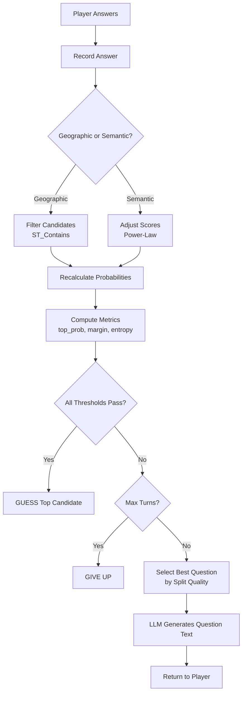

# Algorithm Specification

This document defines the mathematical formulas and decision logic for the geographic guessing game. All tunable values are stored in config tables and referenced by key name. Most algorithm parameters live in `game_logic.config` (server-only), while `public.config` holds client-visible settings like `game.max_turns`.

## Overview

The game uses four core algorithms:

1. **Candidate Scoring** - Rank places by similarity to description
2. **Confidence Decision** - Determine when to guess vs ask
3. **Trait Matching** - Update scores based on question answers
4. **Question Selection** - Choose maximally discriminating questions

All logic runs in PostgreSQL. Frontend receives only the decision outcome.

## Turn Flow



---

## 1. Candidate Scoring

### Initial Scoring

Places are scored by semantic similarity to the player's description using pgvector inner product on normalized embeddings:

```
raw_score(place) = similarity(place.embedding, description.embedding)
```

For normalized vectors, inner product is equivalent to cosine similarity. The `<#>` operator returns negative values (more negative = more similar), so we negate to get positive similarity scores.

### Initial Candidate Selection

Candidates are selected using threshold with cap:

```
1. Get all places with raw_score >= config.scoring.initial_candidate_threshold
2. Order by raw_score descending
3. Limit to config.scoring.max_initial_candidates
```

This ensures:

- Only semantically relevant places are considered (threshold)
- Performance stays bounded regardless of database size (cap)

### Probability Distribution

Raw scores are converted to probabilities using temperature-scaled softmax:

```
P(place_i) = exp(raw_score_i / config.scoring.temperature) / Σ exp(raw_score_j / config.scoring.temperature)
```

Lower temperature values create sharper distributions (amplify score differences). Higher values create flatter distributions (more uncertainty).

After each answer, probabilities are recalculated to reflect updated scores.

---

## 2. Confidence Decision

### Decision Metrics

Three metrics determine whether to guess or ask another question:

**Top Probability** - Confidence in best candidate

```
top_prob = max(P(place_i))
```

**Separation Margin** - Gap between top two candidates

```
margin = P(top_candidate) - P(second_candidate)
```

**Normalized Entropy** - Distribution concentration

```
entropy = -Σ P(i) × ln(P(i))
normalized_entropy = entropy / ln(candidate_count)
```

Ranges from 0 (all confidence in one candidate) to 1 (uniform distribution).

### Decision Rule

```
IF top_prob >= config.confidence.top_prob_threshold
   AND margin >= config.confidence.margin_threshold
   AND normalized_entropy <= config.confidence.entropy_threshold
THEN → GUESS top candidate
ELSE → ASK another question
```

Each metric catches different failure modes:

- `top_prob` catches "no clear winner"
- `margin` catches "top two too close"
- `entropy` catches "confidence spread across many candidates"

### Edge Cases

| Scenario                     | Behavior                  |
| ---------------------------- | ------------------------- |
| Single candidate remaining   | Automatic GUESS           |
| All scores identical         | All thresholds fail → ASK |
| Two candidates, nearly equal | Margin fails → ASK        |

---

## 3. Trait Matching

When the player answers a question about a trait, candidate scores are adjusted based on how well each place matches that trait.

### Match Strength

Calculate similarity between each candidate and the asked trait:

```
match_strength(place, trait) = similarity(place.embedding, trait.embedding)
```

### Match Zones

Match strength falls into zones based on configured thresholds:

```
IF match_strength >= config.traits.strong_match_threshold
   → STRONG match
ELSE IF match_strength >= config.traits.partial_match_threshold
   → PARTIAL match
ELSE
   → WEAK match
```

### Score Adjustment

Adjustments use power-law scaling to weight stronger matches more heavily:

```
adjustment_magnitude = config.traits.base_weight × match_strength^config.traits.beta
```

The direction depends on the answer and match:

| Answer   | Match          | Effect                                         |
| -------- | -------------- | ---------------------------------------------- |
| YES      | Strong/Partial | Boost (positive adjustment)                    |
| YES      | Weak           | Penalty (candidate lacks affirmed trait)       |
| NO       | Strong/Partial | Penalty (candidate has denied trait)           |
| NO       | Weak           | Boost (candidate correctly lacks denied trait) |
| NOT SURE | Any            | No adjustment                                  |

### Applying Adjustments

```
new_score(place) = old_score(place) + (direction × adjustment_magnitude)
```

After adjustments, recalculate probability distribution via softmax.

---

## 4. Question Selection

### Goal

Select the question that maximally discriminates between current candidates. The ideal question splits candidates 50/50 (half would answer yes, half no).

### Split Quality

For each potential trait question, calculate what fraction of candidates match:

```
fraction_matching = count(match_strength >= config.questions.match_threshold) / candidate_count
```

Split quality measures how close to 50/50:

```
split_quality = 1 - |0.5 - fraction_matching|
```

| Fraction Matching | Split Quality |
| ----------------- | ------------- |
| 0.50              | 1.0 (perfect) |
| 0.30 or 0.70      | 0.8 (good)    |
| 0.10 or 0.90      | 0.6 (poor)    |
| 0.00 or 1.00      | 0.5 (useless) |

### Selection Algorithm

```
1. Get all traits not yet asked in this session
2. For each trait, calculate split_quality against current candidates
3. Filter traits where split_quality >= config.questions.min_split_quality
4. Select trait with highest split_quality
5. TIEBREAKER: If multiple traits have equal split_quality,
   prefer the trait most similar to the player's description
```

### Poor Split Quality

If no trait meets `min_split_quality` threshold:

- Select the trait with the highest split_quality anyway (best available)
- The question may not be very discriminating, but it's what we have
- Over time, as more games are played and learning happens, the trait database improves
- No special fallback logic - system always picks the best available option

### Geographic vs Semantic Questions

The game can ask about geographic regions (PostGIS) or semantic traits (pgvector).

```
1. Calculate best geographic question split_quality
2. Calculate best semantic question split_quality
3. IF geographic_split >= config.questions.geographic_preference_threshold
   → Ask geographic question (binary filter is simpler)
4. ELSE
   → Ask semantic question with best split_quality
```

Geographic questions use PostGIS `ST_Contains` for binary in/out filtering. Semantic questions use the trait matching system described above.

---

## 5. Spatial Filtering

### Integration Pattern

Each turn asks ONE question type (geographic OR semantic). This enables sequential filtering rather than complex hybrid scoring.

**Geographic Answer (YES):**

```
candidates = candidates.filter(ST_Contains(affirmed_region, place.geom))
```

**Geographic Answer (NO):**

```
candidates = candidates.filter(NOT ST_Contains(denied_region, place.geom))
```

**Semantic Answer:**
Apply trait matching adjustments (Section 3), then recalculate probabilities.

### Why Not Hybrid Scoring?

A weighted formula like `score = w1 × semantic + w2 × spatial` would require tuning weights. Since each turn is single-mode, one weight would always be zero. Sequential filtering achieves the same result with simpler logic.

---

## 6. Trait Sources

Traits are extracted from real Nominatim data by LLM, not invented or hardcoded.

### Extraction Sources

| Nominatim Field      | Trait Examples             |
| -------------------- | -------------------------- |
| `class`              | tourism, historic, natural |
| `type`               | museum, castle, peak       |
| `extratags.height`   | tall structure, very tall  |
| `extratags.material` | iron, stone, glass         |
| `extratags.heritage` | UNESCO World Heritage      |
| `address.country`    | Located in France          |

### Embedding Generation

1. LLM extracts trait descriptions from Nominatim data
2. Each trait gets an embedding (same model as places)
3. Place embedding generated from concatenated trait descriptions

### Handling Imperfect Traits

LLM extraction produces imperfect, inconsistent traits. Mitigations:

- Conservative thresholds reduce false positive matches
- Power-law scaling naturally dampens weak matches
- Near-synonyms ("metal" ≈ "iron" ≈ "steel") are captured by embedding similarity

---

## 7. Configuration Reference

All tunable parameters stored in config tables (key format: `category.parameter`):

- `public.config` - Client-visible settings
- `game_logic.config` - Server-only settings (most algorithm parameters)

### Game (public.config)

- `game.max_turns` - Maximum turns before giving up (client needs for UI)

### Scoring (game_logic.config)

- `scoring.temperature` - Softmax temperature for probability distribution
- `scoring.initial_candidate_threshold` - Minimum similarity to become candidate
- `scoring.max_initial_candidates` - Maximum candidates to consider (cap)

### Confidence Decision (game_logic.config)

- `confidence.top_prob_threshold` - Minimum top probability to guess
- `confidence.margin_threshold` - Minimum gap between top two candidates
- `confidence.entropy_threshold` - Maximum normalized entropy to guess

### Trait Matching (game_logic.config)

- `traits.strong_match_threshold` - Similarity for strong match zone
- `traits.partial_match_threshold` - Similarity for partial match zone
- `traits.base_weight` - Maximum adjustment magnitude
- `traits.beta` - Power-law exponent (1=linear, >1=emphasize strong matches)

### Question Selection (game_logic.config)

- `questions.min_split_quality` - Minimum quality to consider a question
- `questions.match_threshold` - Similarity threshold for "matches trait"
- `questions.geographic_preference_threshold` - Prefer geographic if split >= this

### LLM (game_logic.config)

- `llm.extraction.model` - Model for trait extraction
- `llm.extraction.temperature` - Temperature for extraction (low = precise)
- `llm.extraction.max_tokens` - Max tokens for extraction response
- `llm.extraction.prompt` - Prompt template for trait extraction

- `llm.question.model` - Model for question generation
- `llm.question.temperature` - Temperature for questions (higher = creative)
- `llm.question.max_tokens` - Max tokens for question response
- `llm.question.prompt` - Prompt template for question generation

---

## 8. Index Requirements

The algorithms require these indexes for efficient operation:

| Table  | Column    | Index Type | Operator Class |
| ------ | --------- | ---------- | -------------- |
| places | embedding | HNSW       | vector_ip_ops  |
| places | geom      | GIST       | -              |
| traits | embedding | HNSW       | vector_ip_ops  |

---

## References

- `spec/architecture.md` - Data model and API contracts
- `spec/gameplay.md` - Game flow and user experience
- `supabase/seeds/00_static_data.sql` - Configuration values
- `supabase/db/functions/game/` - Implementation
