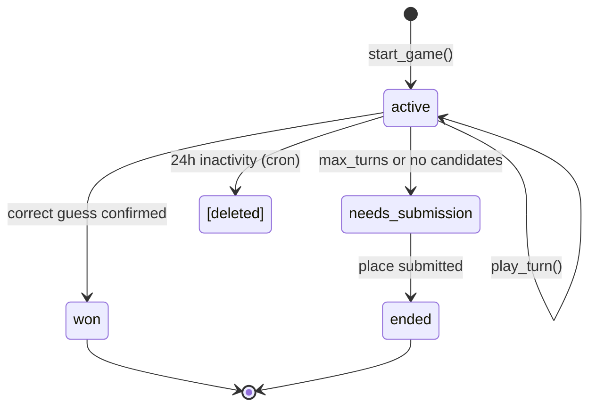

# Game Flows and User Experience

## Core Game Mechanics

### Confidence-Based Guessing

The game guesses whenever it's confident about a place. Confidence is determined by three metrics (see `spec/algorithm.md` for details):

- **Top probability** - Confidence in best candidate
- **Margin** - Gap between top two candidates
- **Entropy** - Whether confidence is concentrated or spread thin

All three must pass their thresholds to trigger a guess.

### Turn Counting

- Every answer (yes, no, not sure) counts as 1 turn towards max_turns
- All answers are stored and passed to LLM for context
- Wrong guesses also cost 1 turn

### Question Selection

The system selects the most discriminating question to split candidates efficiently:

- Goal: Split candidates as evenly as possible (50/50 ideal)
- Analyze which traits would divide current candidates best
- Pick trait that either eliminates most candidates OR confirms top candidate
- LLM generates natural language question about the selected trait
- Question context includes: description, previous answers, current candidates, geographic regions

## Game Flows

### Flow 1: Successful Identification

**1. Game Start**

- Player enters place description (e.g., "A huge city of palaces and busy markets")
- System generates embedding from description
- System finds initial candidate places using semantic similarity
- System selects first question OR makes immediate guess if highly confident

**2. Question Loop**

- System asks yes/no question (geographic or semantic)
- Player answers: "Yes", "No", or "Not sure"
- System updates candidate list and confidence scores
- System repeats until confident or max turns reached

**3. Confident Guess**

- System reaches confidence threshold for a place
- System asks: "Is it [Place Name]?"
- Player confirms: "Yes, that's correct!"
- Game ends successfully
- **Learning:**
  - Registered users: Learning happens immediately
  - Anonymous users: Session marked pending review

### Flow 2: Wrong Guess, Then Success

**1. Game asks: "Is it Paris?"**

- Player responds: "No"
- System eliminates Paris from future guesses in this session
- System continues asking questions (if turns remaining)

**2. Another candidate reaches confidence**

- System asks: "Is it Istanbul?"
- Player confirms: "Yes!"
- Game ends successfully
- **Learning:**
  - Registered users: Learning happens immediately
  - Anonymous users: Session marked pending review

### Flow 3: Max Turns Reached - Give Up

**1. Game reaches max_turns**

- No candidate reached confidence threshold, OR
- All high-confidence candidates were guessed wrong, OR
- No candidates remaining

**2. System gives up**

- System displays: "I couldn't identify your place. Can you tell me what it is?"
- Player types place name (e.g., "Marrakech")

**3. Place submission via Nominatim**

- System searches Nominatim for place name
- System shows suggestions to player
- Player picks correct place from suggestions
- New place created through enrichment:
  - Extract traits from OSM data
  - Generate embedding from enriched description
  - Store in database
  - **New place marked pending review** (excluded from candidate matching)

**4. Learning and Review**

- **Registered users:**
  - Session and new place approved immediately
  - Learning happens immediately
  - New place available for matching
- **Anonymous users:**
  - Session marked pending review
  - New place marked pending review
  - Both excluded until admin approval
- Game ends

### Flow 4: "Not Sure" Answers

**During any question:**

- Player clicks "Not sure"
- Answer is stored in game_answers
- Answer is passed to LLM for context
- Turn counter increments (same as yes/no)
- No score adjustments applied to candidates
- System generates new question
- Game continues

## Game States



**Stored states** (as values of the `game_sessions.status` enum):

### active

- Game in progress
- Asking questions, making guesses
- Processing answers, updating confidence

### won

- Place correctly identified
- Learning applied (registered) or pending review (anonymous)
- Results shown to player

### needs_submission

- Max turns reached or no candidates remaining
- Awaiting player to submit the correct place via Nominatim

### ended

- Player submitted place after giving up
- If place exists: Link session, add new traits from description
- If place is new: Create from Nominatim, extract traits
- Learning applied (same process for both)

### [deleted]

- Abandoned sessions (24h inactivity) are hard deleted by cron
- Not a stored state - sessions simply removed

## Configuration Variables

Configuration stored in two tables by visibility. See `spec/algorithm.md` for complete reference.

- `public.config` - Client-visible (e.g., `game.max_turns` for UI turn counter)
- `game_logic.config` - Server-only (scoring, thresholds, LLM settings)

### Game Rules

- `game.max_turns` - Maximum turns before giving up

### Scoring & Confidence

- `scoring.*` - Candidate scoring parameters
- `confidence.*` - Three-metric guess decision thresholds
- `traits.*` - Trait matching parameters (power-law scaling)
- `questions.*` - Question selection parameters

### LLM Configuration

- `llm.extraction.*` - Trait extraction (model, temperature, prompt)
- `llm.question.*` - Question generation (model, temperature, prompt)

## User Experience Principles

### Immediate Engagement

- Player can start game with just a description
- Supabase anonymous auth (automatic)
- No registration required to play

### Intelligent Interaction

- System asks strategic questions to narrow candidates
- Questions are contextual based on current candidates
- Natural language questions generated by LLM

### Visual Feedback

- Map shows candidate places
- Confidence scores displayed
- Progress through turns visible

### Learning System

- Every game improves the system
- New traits discovered from player descriptions
- Place embeddings regenerated as traits are added

### Authentication Progression

- **Anonymous users:**
  - Play games immediately (Supabase anonymous auth)
  - Sessions marked pending review
  - Cannot contribute to learning until reviewed
- **Registered users:**
  - Access game history (past games with outcomes)
  - View personal stats (games played, win rate, avg turns, places added)
  - Sessions contribute to learning immediately
  - New places approved immediately
- **Account upgrade:**
  - Anonymous user creates registered account
  - All their pending sessions automatically approved
  - All pending learning applied via database triggers
  - Game history preserved and accessible

## UI State Machine

### States

- **idle** - Waiting for user input
- **loading** - Async RPC operation in progress
- **ready** - Data received, displaying next turn
- **error** - Error occurred, showing error message

### State Transitions

```
idle → loading: User action (start game, answer question, submit place)
loading → ready: RPC success, fetch updated `game_sessions` row
loading → error: RPC failure, display error, stay in current view
error → idle: User dismisses error, ready for retry
```

### Loading State Handling

- Button-level loading indicators (no global overlay)
- Button disabled during async operation
- Button shows loading indicator (spinner)
- No blocking UI, user can see current game state

### Error State Handling

- Parse error_code from RPC response
- Look up translation in i18n locale file
- Display translated error message to user
- Keep UI in current state (no navigation)
- Re-enable button for manual retry
- No automatic retries

### UI Flow Example

```
[Initial State: idle]
  User enters description → clicks "Start"

[State: loading]
  Button disabled, showing spinner
  RPC: start_game(description)

[Success Path: loading → ready]
  Receive session_id
  Fetch the `public.game_sessions` row for this session
  Display question from next_turn
  Button enabled

[Error Path: loading → error]
  Receive error_response
  Display: "Unable to process description. Please try again."
  Stay on input screen
  Button enabled for retry

[User retries]
  error → idle → loading → ...
```
