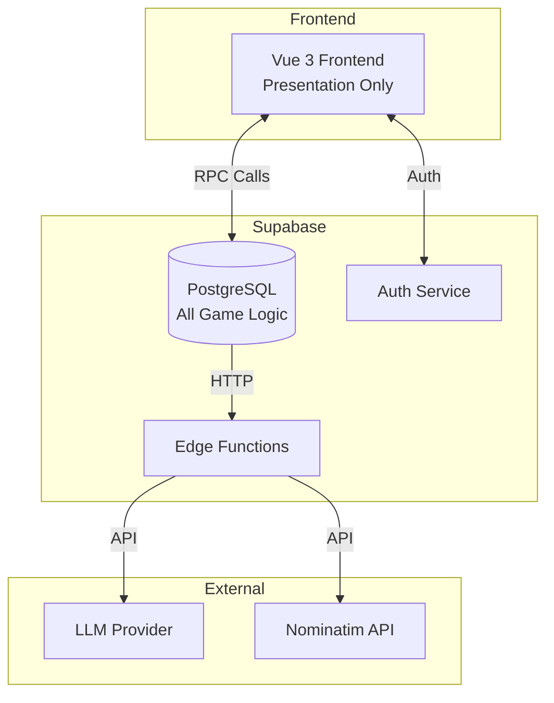
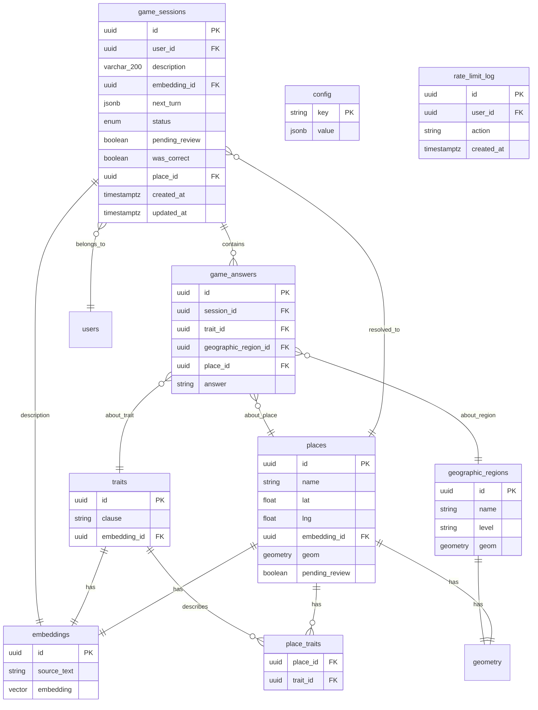
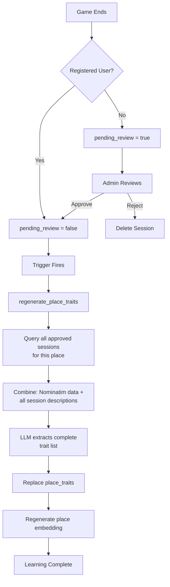

# Architecture Overview

## System Architecture

10x-Mapmaster follows a **database-first architecture** where PostgreSQL is the single source of truth for all business logic, game state, and data operations.



## Core Principles

### 1. Database-First Design

**The game is a state machine implemented in PostgreSQL.**

- Heavy vector and LLM logic runs in database context where the knowledge lives
- Any frontend can connect via two RPC functions (start_game, play_turn)
- Frontend is purely presentational - no game logic, scoring, or state management
- Database state via RLS-protected views

**Why:** Keep game logic close to data, enable multiple clients, leverage PostgreSQL's computation power for vector operations.

### 2. Traits-Based System

**Embeddings capture pure trait knowledge, not grammar.**

- Store canonical traits as structured data
- Generate embeddings from traits
- Identify places from ANY description by matching trait embeddings
- LLM generates natural language questions about traits

**Why:** Trait embeddings enable semantic matching across any description language. Grammar and phrasing don't affect identification.

### 3. Geographic + Semantic Intelligence

**A geographic game needs geographic constraints.**

- PostGIS for proper polygon handling (places and regions)
- Natural Earth data for geographic regions
- Nominatim provides geometry to plot place polygons on map
- Two-stage filtering: Geographic location → Semantic trait matching
- Confidence-based guessing explores vector database capabilities

**Why:** Narrow candidates geographically first, then use semantic similarity. PostGIS enables proper spatial queries and polygon visualization.

## Technology Stack

### Backend

- **Supabase (PostgreSQL)** - Managed PostgreSQL with built-in auth and RLS
- **pgvector** - Vector similarity search (comes with Supabase/PostgreSQL)
- **postgis** - Spatial operations and polygon handling
- **Row Level Security (RLS)** - Data access control via auth.uid()
- **Edge Functions** - External service integrations

**Why:** Supabase provides managed PostgreSQL with pgvector and authentication. All core functionality in one platform.

### Frontend

- **Vue 3** with Composition API
- **Pinia** - State management
- **MapLibre GL JS** - Interactive map visualization (globe projection)
- **deck.gl** - 3D extruded polygon markers (@deck.gl/core, @deck.gl/layers, @deck.gl/mapbox)
- **shadcn-vue** - Component library for rapid UI development
- **Tolgee** - Translation management (i18n)
- **nominatim-ts** - Nominatim API client for place search autocomplete (direct from frontend, read-only)
- **CARTO Basemaps** - Free vector tile provider
  - Light theme: `https://basemaps.cartocdn.com/gl/positron-gl-style/style.json`
  - Dark theme: `https://basemaps.cartocdn.com/gl/dark-matter-gl-style/style.json`
  - Switches based on UI theme (light/dark/system)

### External Services

**Development:**

- **Ollama** - Easiest way to run LLMs locally
- Local embedding generation

**Production:**

- **Supabase gte-small** - Embedding generation (384d)
- **Third-party LLM provider** (TBD) - Question generation and trait extraction
- **Nominatim** - Place enrichment and geometry data
- **Natural Earth** - Geographic region data

## Key Architectural Decisions

### Database Functions as API

Public-facing game operations:

- `start_game(description_text)` - Initialize game
- `play_turn(session_id, response)` - Process turn

All other game logic functions are in private schema.

### Configuration-Driven Behavior

All game parameters stored in database tables, split by visibility:

| Table    | Schema       | Access                            | Contents                                 |
| -------- | ------------ | --------------------------------- | ---------------------------------------- |
| `config` | `public`     | SELECT for authenticated users    | `game.max_turns`                         |
| `config` | `game_logic` | No direct access (private schema) | Scoring weights, thresholds, LLM prompts |

- `public.config` - Client-visible settings (turn counter display)
- `game_logic.config` - Sensitive settings accessed only by SECURITY DEFINER functions
- Runtime changes without code deployment

### Game State Storage

- `game_answers` table stores all player responses
- System uses answers to determine next question or guess
- Append-only design (answers never modified or deleted)

**Game session state API**

The `game_sessions` table is the primary API surface for game state:

- Session metadata (id, `status` enum, turn count, timestamps)
- Current turn data stored in `next_turn` JSONB
- Candidate list and confidence scores embedded inside `next_turn`
- Question/guess details embedded inside `next_turn`

Frontend reads the `public.game_sessions` row for the current `session_id` after each RPC call to get updated state. Row Level Security ensures users can see only their own sessions.

### LLM Integration

**Purpose:**

- Generate natural language questions about traits/regions
- Extract traits from place data and player descriptions
- Avoid maintaining thousands of question templates
- Context-aware question generation based on game state

**Provider-Agnostic Architecture:**

Supabase Edge Functions (Deno runtime) abstract provider differences. The database passes parameters, the edge function handles connection and secrets:

| Environment | Embeddings                          | LLM          |
| ----------- | ----------------------------------- | ------------ |
| Development | Ollama (gte-small compatible, 384d) | Ollama       |
| Production  | Supabase gte-small (384d)           | Provider TBD |

**Key constraint:** Same LLM model runs locally (Ollama) and in production (via provider). This ensures consistent behavior between development and production.

Edge functions read `LLM_PROVIDER` and `EMBEDDING_PROVIDER` from environment variables and API keys from Supabase Vault. The database never sees secrets – it only calls the edge function with parameters and receives back embeddings or generated text.

**Required LLM capabilities:**

- Natural language question generation
- Multilingual output (language passed as parameter)
- Trait extraction from structured data
- Reliable instruction following

**LLM Context Composition:**

The system provides LLM with:

- Player's original description
- Previous questions and answers from this session
- Current candidate places (names, confidence scores)
- Geographic regions being considered
- Selected trait or region to ask about
- Language code for question generation

**LLM prompt structure (stored in `game_logic.config`):**

- System instructions
- Context data (description, answers, candidates)
- Task: Generate yes/no question about specific trait/region
- Output format: Natural language question in target language

**LLM does NOT:**

- Select which trait to ask about (database logic)
- Calculate confidence scores (database logic)
- Make gameplay decisions (database logic)
- LLM only translates selected trait into natural language

## API Contracts

### Public RPC Functions

**start_game**

```
Input:
  description: text       - Player's place description
  language_code: text     - Language for LLM question generation (e.g., "en", "pl")

Output:
  session_id: uuid

Behavior:
  - Creates new game_session
  - Generates embedding from description
  - Calls get_candidates() to find initial matches
  - Calls decide_next_turn() to set first question/guess
  - Returns session_id

Frontend flow:
  - Call start_game()
  - Fetch the `public.game_sessions` row for the returned `session_id`
```

**play_turn**

```
Input:
  session_id: uuid
  answer: enum           - 'yes' | 'no' | 'not_sure'

Output:
  session_id: uuid

Behavior:
  - Records answer in game_answers
  - Calls get_candidates() with updated filters
  - Calls decide_next_turn() to determine next action
  - Updates game_session.next_turn
  - Returns session_id

Frontend flow:
  - Call play_turn()
  - Refetch the `public.game_sessions` row for this `session_id`
```

**submit_place**

```
Input:
  session_id: uuid
  osm_id: text          - Nominatim OSM ID (e.g., "way/5013364")

Output:
  void  -- RPC returns successfully on 2xx, no payload

Behavior (all in database function):
  1. Validate auth and session ownership
  2. Call fetch-place edge function with osm_id
  3. Edge function fetches Nominatim data, returns to database
  4. Parse Nominatim response, extract traits via LLM
  5. Generate embedding from trait clauses
  6. Create/update place record with pending_review flag
  7. Link session to place, update session status
  8. If registered user: triggers learning immediately
  9. If anonymous user: session stays pending_review
  10. Return success

Frontend flow:
  - User searches Nominatim directly (via nominatim-ts library)
  - User selects from dropdown suggestions
  - Frontend calls submit_place RPC with session_id and selected osm_id
  - Database handles all enrichment logic
  - Frontend shows completion state
```

### Edge Functions (Database Helpers)

All edge functions called ONLY by database via http extension.

Edge functions own provider connection logic. Database passes what it needs, edge function figures out how to get it.

**generate-embedding**

```
Method: POST /functions/v1/generate-embedding

Input:
  {
    text: string        - Text to embed
  }

Output:
  {
    embedding: number[] - 384d vector representation
  }

Called by:
  - Database function: get_or_create_embedding()

Provider logic:
  - Edge function reads LLM_PROVIDER from environment
  - Connects to Ollama/Supabase/external provider accordingly
  - Database doesn't know or care which provider
  - Always returns consistent 384d vectors
```

**call-llm**

```
Method: POST /functions/v1/call-llm

Input:
  {
    model: string,
    temperature: number,
    max_tokens: number,
    prompt: string
  }

Output:
  {
    response: string    - LLM generated text
  }

Called by:
  - Database function: extract_traits()
  - Database function: generate_question()

Provider logic:
  - Edge function reads LLM_PROVIDER from environment
  - Connects to Ollama/Together/external provider accordingly
  - API keys stored in Supabase secrets, not in database
  - Database passes model/settings, edge function handles connection
```

**fetch-place**

```
Method: GET /functions/v1/fetch-place/{osm_id}

Input:
  Path parameter: osm_id (e.g., "way/5013364")

Output:
  {
    name: string,
    display_name: string,
    lat: number,
    lng: number,
    boundingbox: [string, string, string, string],
    extratags: Record<string, unknown>,
    address: Record<string, unknown>,
    geojson?: { type: string, coordinates: unknown }
  }

Called by:
  - Database function: enrich_place()

Implementation:
  - Calls Nominatim lookup API
  - Returns structured place data
```

### Game State Structure

#### Game session row

The `public.game_sessions` table exposes the following columns to the frontend (RLS-protected):

- `id` (uuid) – session id
- `user_id` (uuid) – owner user
- `description` (text) – original user description
- `embedding_id` (uuid) – reference to description embedding (vector not exposed)
- `next_turn` (jsonb) – JSON payload described below
- `status` (enum) – `active` | `won` | `needs_submission` | `ended`
- `pending_review` (boolean)
- `was_correct` (boolean)
- `place_id` (uuid, nullable) – resolved place when known
- `created_at` / `updated_at` (timestamptz)

The frontend selects these columns explicitly rather than using `SELECT *`.

**next_turn JSONB format:**

Question turn:

```typescript
{
  action: 'question',
  question: {
    trait_id?: uuid,        // If semantic question
    region_id?: uuid,       // If geographic question
    text: string,           // Natural language question
    category: 'semantic' | 'geographic'
  },
  candidates: Array<{
    place_id: uuid,
    name: string,
    confidence: number,
    lat: number,
    lng: number
  }>
}
```

Guess turn:

```typescript
{
  action: 'guess',
  guess_place: {
    place_id: uuid,
    name: string,
    lat: number,
    lng: number,
    confidence: number
  },
  candidates: Array<{
    place_id: uuid,
    name: string,
    confidence: number,
    lat: number,
    lng: number
  }>
}
```

Give up turn:

```typescript
{
  action: 'give_up',
  reason: 'max_turns' | 'no_candidates',
  candidates: Array<{
    place_id: uuid,
    name: string,
    confidence: number,
    lat: number,
    lng: number
  }>
}
```

**Frontend integration:**

- Frontend is completely stateless
- Maps `next_turn.action` to UI components
- All game logic in database
- In the database, `next_turn` is stored as `jsonb`, so `supabase gen types` exposes it as a generic `Json` field on the `game_sessions` row.
- The three shapes above are the canonical contract for that JSON; the frontend defines a small discriminated TypeScript union (`action: 'question' | 'guess' | 'give_up'`) that matches this spec and composes it with the generated `game_sessions` row type.

**Data refresh patterns:**

No active game (home screen):

- Supabase realtime subscription to `places` table
- Shows all known places on map
- Updates automatically when new places added

Active game (gameplay):

- Manual fetch of the `public.game_sessions` row after each RPC call
- No realtime subscription during gameplay
- Game store handles refresh after start_game() and play_turn()

**State management:**

- Game store tracks current session_id
- After RPC success: Select the `public.game_sessions` row for this session
- Reactive UI updates from table data
- No polling, no realtime during gameplay

## Error Handling

### Philosophy

- **Fail gracefully** - No automatic retries or fallbacks
- **Transparent errors** - All error codes translated for users
- **Security-first** - Return minimal context, avoid exposing internals
- **Manual retry** - User decides when to retry, no auto-retry logic
- **State preservation** - UI stays in current state on error

### Error Response Structure

All database functions that can fail return standardized error response:

```sql
CREATE TYPE error_response AS (
  error_code text, -- Enum value for i18n translation lookup
  http_status int, -- Standard HTTP status code
  details jsonb -- Optional context (minimal, never sensitive)
);
```

Example returns:

```sql
-- Session not found (security-safe, covers 401/403)
RETURN ROW('session_not_found', 404, NULL)::error_response;

-- Service unavailable
RETURN ROW('embedding_failed', 503, NULL)::error_response;

-- Invalid input with context
RETURN ROW('invalid_answer', 400, '{"expected": ["yes", "no", "not_sure"]}'::jsonb)::error_response;
```

**Public RPC response helpers**

- Public RPC functions (`start_game`, `play_turn`, `submit_place`) never construct responses ad hoc.
- A small pair of helper functions in the `game_logic` schema builds:
  - `error_response` values (given `error_code`, `http_status`, and optional `details`)
  - typed success payloads for each RPC (for example, `start_game` returns a composite type with `session_id`).
- This keeps the shape of both success and error responses consistent and ensures `supabase gen types` can expose the exact return types to the frontend.
- Internal helper functions inside `game_logic` may return plain rows/jsonb; only the public RPC boundary is normalized through these helpers.

### HTTP Status Codes

**4xx - Client Errors (user can fix):**

- `400 Bad Request` - Invalid input (malformed data, empty description)
- `404 Not Found` - Resource not found (security-safe, covers unauthorized access)
- `410 Gone` - Session already complete
- `429 Too Many Requests` - Rate limiting exceeded

**5xx - Server Errors (system problem):**

- `500 Internal Server Error` - Unexpected database error
- `503 Service Unavailable` - External service down (LLM, embedding, Nominatim)

### Error Codes Enumeration

**Session Errors (4xx):**

- `session_not_found` - Session does not exist or user lacks access (404)
- `session_already_complete` - Session already finished (410)
- `invalid_description` - Description empty or malformed (400)
- `invalid_answer` - Answer not in allowed values (400)
- `rate_limit_exceeded` - Too many requests (429)

**Place Errors (4xx):**

- `place_not_found` - Place does not exist (404)
- `invalid_osm_id` - OSM ID malformed (400)

**Service Errors (5xx):**

- `embedding_failed` - Embedding generation service unavailable (503)
- `llm_failed` - LLM service unavailable (503)
- `place_enrichment_failed` - Nominatim lookup failed (503)
- `database_error` - Unexpected database failure (500)

### Frontend Error Handling

**Flow:**

1. RPC call returns an `error_response` (either as an explicit row or via HTTP error semantics)
2. Parse `error_code` from response
3. Look up translation in i18n file
4. Display translated error to user
5. Keep UI in current state (no navigation, no reset)
6. Re-enable input for manual retry

**No automatic behavior:**

- No retries
- No fallbacks
- No error recovery logic
- User controls next action

### Client data fetching helpers

On the frontend, composables and stores wrap Supabase calls in a small helper that normalizes results into one of two shapes:

- Success: `{ data: ... }` with no `error` field
- Failure: `{ error: ... }` with no `data` field

This mirrors the `data`/`error` model of `@supabase/supabase-js` and makes it straightforward to route `error_response` payloads into the UI error state machine.

## Data Model



### Core Entities

**places**

- Geographic locations with names and coordinates
- Each place linked to multiple traits via `place_traits` joining table
- Place embedding generated from joined trait strings
- Each place has geometry (polygon) for map visualization

**traits**

- Canonical trait definitions (e.g., "Mediterranean climate", "coastal location", "ancient architecture")
- Each trait has an embedding
- Traits are what the system asks about

**place_traits**

- Many-to-many relationship between places and traits
- Tracks which traits describe each place
- Used for split quality calculation in question selection

**embeddings**

- Vector representations for semantic similarity
- Stores source_text (what was embedded) for debugging/transparency
- Referenced by places, traits, and game sessions

**game_sessions**

- User's current game state
- `description` - Player's place description (max 200 characters, enforced by DB constraint)
- References the description embedding
- Turn count is derived: `SELECT COUNT(*) FROM game_answers WHERE session_id = ?`
- `status` is an enum stored on the row:
  - `active` – game in progress
  - `won` – correct guess confirmed
  - `needs_submission` – max turns reached or no candidates remaining
  - `ended` – player submitted place after giving up
- `pending_review` flag controls learning contribution:
  - Registered users: `pending_review=false` (immediate learning)
  - Anonymous users: `pending_review=true` (requires approval)
  - Trigger fires when `pending_review` changes from true to false
  - Anonymous user registration: All their sessions auto-approved

**game_answers**

- Player's responses to questions and guesses
- Links to game session and what was asked about
- Exactly ONE of `trait_id`, `geographic_region_id`, or `place_id` is populated:
  - `trait_id` → semantic question ("Does it have X trait?")
  - `geographic_region_id` → geographic question ("Is it in X region?")
  - `place_id` → guess response ("Is it X place?")
- Answer values: `'yes'`, `'no'`, `'not_sure'`
- `'not_sure'` only valid for questions (constraint: `place_id IS NULL`)

**geographic_regions**

- Polygon regions from Natural Earth data
- Used for geographic filtering

**place_traits**

- Join table linking places to traits (many-to-many)
- Columns: `place_id` (FK), `trait_id` (FK) - composite primary key
- Fully replaced on each `regenerate_place_traits()` call

**config tables**

Runtime configuration stored as key-value pairs:

- Structure: `key` (text PK), `value` (jsonb)
- `public.config` - Client-visible settings
  - `game.max_turns` - Displayed in UI turn counter
- `game_logic.config` - Server-only settings (in private schema)
  - `scoring.*` - Candidate scoring parameters
  - `confidence.*` - Guess decision thresholds
  - `traits.*` - Trait matching parameters
  - `questions.*` - Question selection parameters
  - `llm.*` - LLM settings (model, temperature, prompts)

**rate_limit_log**

- Tracks API calls for rate limiting enforcement
- Columns: `id`, `user_id`, `action` (e.g., 'start_game'), `created_at`
- `check_rate_limit(user_id, action)` counts recent entries
- pg_cron job cleans up entries older than rate limit window

**Stats views**

Two read-only views expose aggregated statistics:

- `public.user_stats` – per-user stats, one row per `user_id`:
  - `games_played`, `games_won`, `win_rate`, `avg_turns_to_win`, `places_added`, `last_played_at`
  - RLS ensures each user sees only their own row (`user_id = auth.uid()`).
- `public.global_stats` – global stats across all games/knowledge:
  - `total_games`, `games_last_24h`, `total_users`, `total_places`, `total_traits`, `overall_win_rate`, `avg_turns_to_win`
  - Readable by all authenticated users.

Both views are derived from `game_sessions`, `game_answers`, `places`, and `traits` and provide the data backing the Stats UI and any public-facing stats.

### Key Relationships

- **Place → Embedding**: Semantic similarity matching
- **Place → Traits**: Many-to-many via linking table
- **Place → Geometry**: PostGIS polygon for visualization
- **Game Session → Answers**: One-to-many, full history
- **Game Session → Embedding**: Description semantic vector
- **Game Answer → Trait, Region, or Place**: Answers reference what was asked about (exactly one FK populated)
- **Embeddings**: Store source text and vector, referenced by places/traits/sessions

### Learning and Review Mechanism



**Trigger-Based Learning:**

- Database trigger fires when `game_sessions.pending_review` changes to false
- Trigger calls `regenerate_place_traits(place_id)` which:
  1. Queries all approved sessions for this place: `SELECT description FROM game_sessions WHERE place_id = ? AND pending_review = false`
  2. Combines Nominatim data (stored on place) with all session descriptions
  3. LLM extracts **complete trait list** from combined text (no incremental merging)
  4. Replaces `place_traits` entirely with new list (avoids deduplication complexity)
  5. Regenerates place embedding from new trait clauses
- Single unified function handles all trait extraction - same process for initial enrichment and learning
- LLM naturally deduplicates by seeing all sources and outputting canonical list

**New Place Submissions:**

- New places created with `pending_review=true` (match session state)
- Place excluded from candidate matching until session approved
- If registered user plays with pending place, place approved with their session
- Multiple anonymous sessions for same pending place wait for any approval

**Place Enrichment Process:**

When a new place is submitted:

1. Query Nominatim by name to get suggestions
2. Player selects correct place from suggestions
3. Fetch full Nominatim data (extratags, address, geometry)
4. LLM extracts traits from Nominatim data (prompt-guided, no hardcoded buckets)
5. Generate embedding from joined trait clauses
6. Store place with traits, embedding, and geometry (polygon from bbox or geojson)

**Unified Trait Extraction:**

A single `regenerate_place_traits(place_id)` function handles all trait extraction:

```
regenerate_place_traits(place_id):
  1. Fetch place's Nominatim data (extratags, address, etc.)
  2. Query all approved sessions:
     SELECT description FROM game_sessions
     WHERE place_id = :place_id AND pending_review = false
  3. Combine all text sources into single context
  4. Call LLM with extraction prompt (from game_logic.config)
  5. LLM returns complete trait list (naturally deduplicated)
  6. DELETE FROM place_traits WHERE place_id = :place_id
  7. INSERT new traits
  8. Regenerate place embedding from joined trait clauses
```

**Why full replacement instead of incremental:**

- LLM sees all sources at once - produces coherent, deduplicated trait list
- No complex "is this trait new?" logic needed
- Traits improve over time as more player descriptions accumulate
- Same function used for initial enrichment and ongoing learning

**Anonymous User Registration:**

- User upgrades anonymous account to registered account
- All their pending sessions automatically approved (`pending_review=false`)
- Triggers fire for each session, applying accumulated learning

## Schema Organization

### Database Schemas

```
PostgreSQL Schemas:
├── extensions       # PostgreSQL extensions (pgvector, postgis)
├── public           # Public API and data tables
├── game_logic       # Private game logic functions
├── auth             # Supabase authentication
└── vault            # Supabase secrets
```

### Source Organization

```
supabase/db/
├── schemas/
│   ├── extensions.sql         # Extensions setup
│   ├── public_schema.sql      # Public schema definition
│   └── game_logic_schema.sql  # Private schema definition
├── public/                    # Public schema contents
│   ├── tables/                # Each file = table + RLS + indexes
│   │                          # Includes public.config (client-visible settings)
│   ├── views/                 # RLS-protected views
│   └── functions/             # Public API functions (start_game, play_turn)
└── game_logic/                # Private schema contents
    ├── tables/                # Includes game_logic.config (server-only settings)
    └── functions/             # Internal game logic functions
```

### Philosophy

- **Hide by default**: Everything starts private, expose only what's necessary
- **Self-contained files**: Each table/function file contains everything related to it
- **Clear API boundary**: Public schema = API contract, game_logic schema = implementation
- **Defense in depth**: Even if permission mistakes happen, private schema not accessible

## Security Architecture

- **Row Level Security** on all tables using `auth.uid()`
- **Supabase authentication required** - all users must be authenticated (regular or anonymous auth)
- **Function-level security**:
  - SECURITY DEFINER for functions needing elevated privileges (start_game, play_turn)
  - All SECURITY DEFINER functions validate `auth.uid() IS NOT NULL`
- **User-scoped data** - RLS policies ensure users see only their own game sessions and answers
- **Stats differentiation** - registered users get game history and stats, anonymous users don't
- **Input validation** - Description length limits, pattern validation, prompt injection detection
- **Rate limiting** - Database-enforced limits on game creation and turn processing
- **Embeddings isolation** - The `embeddings` table is never exposed directly to the frontend; only server-side functions select or update it. Client code reads scalar fields (ids, status, next_turn JSON) from `public.game_sessions` and related views, but never the embedding vectors themselves.

### Validation Strategy

Database schema is the single source of truth for validation rules:

- Constraints defined in PostgreSQL (length limits, patterns, enums)
- TypeScript types for tables, views, and functions are generated via `supabase gen types`
- Frontend code (stores, composables, components) consumes these generated types directly wherever possible
- Zod schemas are inferred from the generated types when runtime validation is needed (forms, API responses), rather than hand-writing parallel schemas
- No duplication of validation rules between frontend and backend

## Authentication

- **Anonymous auth** - Automatic sign-in on first visit, seamless gameplay without registration
- **Third-party OAuth** - Registration via OAuth providers (GitHub, etc.)
- **Account upgrade** - Anonymous users can register to preserve history and unlock stats
- **Session management** - Supabase handles tokens, refresh, and session cleanup
